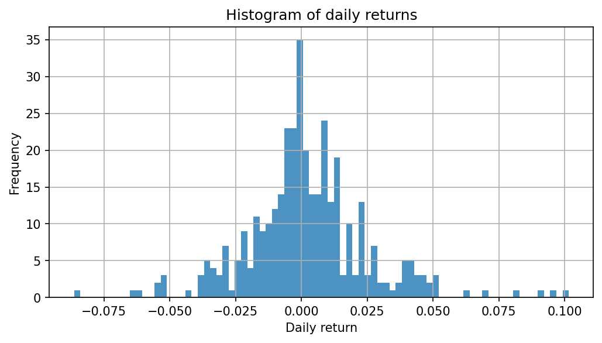
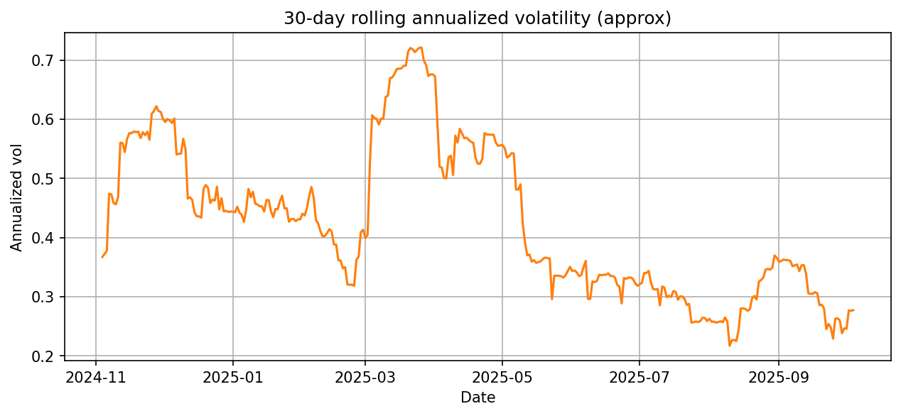

# Phân tích dữ liệu & mã nguồn — Bitcoin (báo cáo chi tiết)
> Generated file: `D:\Trực quan hóa dữ liệu\TQH\data\processed\coingecko_bitcoin_market_chart_last365d_1D_analysis.json`

## Giới thiệu đề tài
Trong báo cáo này chúng tôi trình bày quy trình thu thập, xử lý, phân tích và trực quan hóa dữ liệu giá của Bitcoin dựa trên API CoinGecko. Mục tiêu là xây dựng một pipeline reproducible để lấy dữ liệu lịch sử, chuẩn hoá thành chuỗi thời gian OHLC theo ngày, tính các chỉ số tài chính cơ bản (lợi suất, log-return, moving averages, volatility, drawdown), hiển thị các biểu đồ tương tác và cung cấp một nền tảng để thử nghiệm các phương pháp dự báo.

## Mục tiêu và phạm vi
- Mục tiêu: Xây dựng báo cáo phân tích dữ liệu hoàn chỉnh cho Bitcoin bao gồm thu thập dữ liệu, tiền xử lý, feature engineering, trực quan hóa và gợi ý hướng phát triển cho dự báo.
- Phạm vi: Dữ liệu được xử lý là chuỗi OHLC theo ngày (daily) trong vòng 365 ngày gần nhất tính từ ngày sinh báo cáo. Không bao gồm dữ liệu intraday chi tiết (nếu cần có thể mở rộng bằng endpoint `ohlc` hoặc dữ liệu trao đổi).

## Cơ sở lý thuyết (tóm tắt)
- Bitcoin: một tài sản kỹ thuật số phân tán, có biến động cao và đặc trưng bởi các sự kiện thị trường lớn (news, halving, lệnh pháp lý). Việc phân tích chuỗi thời gian giá Bitcoin thường tập trung vào lợi suất, độ biến động và các cấu trúc không-đẳng thời gian như clustering volatility.
- Phân tích chuỗi thời gian: các phép biến đổi cơ bản gồm resampling, tính lợi suất đơn vị thời gian (simple returns và log returns), moving averages để bắt xu hướng ngắn/dài hạn, rolling volatility để đánh giá rủi ro, và drawdown để đo rủi ro lịch sử.
- Trực quan hóa: biểu đồ thời gian (line), candlestick cho OHLC, histogram phân phối lợi suất, timeseries cho volatility và heatmap (khi cần phân tích theo giờ/ngày trong tuần).

## Thu thập và xử lý dữ liệu

1) Thu thập
- Dữ liệu được lấy từ CoinGecko public API (endpoints `market_chart` và `market_chart/range`). Do giới hạn của API công cộng (giới hạn truy vấn lịch sử không quá 365 ngày cho mỗi lần gọi), pipeline hỗ trợ lấy theo các đoạn (chunked) và ghép lại.
- Raw JSON lưu trong `data/raw/` cùng metadata trong `data/raw/meta/`.

2) Tiền xử lý
- Parse JSON thành pandas.DataFrame với cột thời gian (datetime UTC), giá (`price`) và volume (nếu có).
- Phát hiện đơn vị timestamp (ms hay s) tự động, quy tất cả về datetime chuẩn.
- Nếu dữ liệu là từng giá (time, price) thay vì OHLC, ta resample theo quy tắc `1D` thành OHLC bằng hàm `resample_to_ohlc`.
- Tính các feature: lợi suất hàng ngày (pct_change), log-return, MA7, MA30, rolling vol 30 ngày (std của log-return nhân sqrt(252) để annualize), drawdown.
- Kết quả lưu ở định dạng Parquet tại `data/processed/` để tải nhanh và duy trì metadata của pipeline.

## Phân tích và trực quan hóa (mở rộng)

Phần này mô tả chi tiết các loại phân tích đã thực hiện, cách trực quan hóa, cách diễn giải các kết quả chính, và hướng dẫn tái tạo các biểu đồ bằng script có sẵn.

Mục tiêu của phần trực quan hóa:
- Hiển thị xu hướng giá (trend) và các vùng biến động (volatility regimes).
- So sánh các chỉ báo (MA7 vs MA30) để nắm bắt crossover và tín hiệu xu hướng ngắn/dài hạn.
- Khám phá phân phối lợi suất và các outlier (risk profile).
- Đo lường rủi ro lịch sử bằng drawdown và rolling volatility.

Dataset dùng: `data/processed/coingecko_bitcoin_market_chart_last365d_1D.parquet` (Daily OHLC + volume + features).

1) Thống kê tóm tắt (reproducible)
- Phạm vi: 2024-10-05 → 2025-10-04 (365 dòng). Các thống kê tóm tắt (min/max/mean/median/std) đã được tính cho cột `close`.
- Ý nghĩa: min/max cho biết biên giá, median/mean thể hiện xu hướng trung tâm, std đo mức rủi ro biến động.

2) Biểu đồ thời gian (Line + MA)
- Mục đích: quan sát xu hướng giá theo thời gian và tác động của moving averages.
- Biểu đồ: Giá đóng cửa (`close`) theo ngày (line) + MA7 (ngắn) và MA30 (dài) superimposed.
- Diễn giải: khi MA7 cắt lên MA30 (golden cross) có thể báo hiệu xu hướng tăng ngắn hạn; ngược lại (death cross) có thể là tín hiệu giảm. Luôn kết hợp volume và context vĩ mô.

3) Candlestick + Volume
- Mục đích: xem cấu trúc nến, áp lực mua/bán (bằng volume) tại các vùng quan trọng.
- Biểu đồ: candlestick (open/high/low/close) với thanh volume dưới trục x.
- Diễn giải: các cây nến lớn kèm volume cao thường gắn với breakouts hoặc capitulation.

4) Histogram lợi suất & phân phối
- Mục đích: đánh giá phân phối lợi suất (fat-tails, skewness) và phát hiện outlier.
- Biểu đồ: histogram của `pct_change` hoặc `log_return` (có overlay KDE nếu cần).
- Diễn giải: tail events (lợi suất cực đoan) cho thấy rủi ro downside/uphside hiếm nhưng mạnh.

5) Rolling volatility (30 ngày) timeseries
- Mục đích: theo dõi regimes biến động theo thời gian, dùng để cân size vị thế hoặc chuyển chiến lược.
- Biểu đồ: `vol_30d` (annualized) vẽ theo ngày; có thể thêm vùng tham chiếu (ví dụ 20%, 50%).

6) Drawdown chart
- Mục đích: minh họa mức giảm từ đỉnh tại mỗi thời điểm (peak-to-trough) để đánh giá rủi ro lịch sử.
- Biểu đồ: chạy `drawdown = (cummax(close) - close) / cummax(close)` hoặc `1 - close/cummax(close)` vẽ theo thời gian.

7) So sánh & chuẩn hóa (indexed performance)
- Mục đích: so sánh performance giữa nhiều file hoặc nhiều khoảng thời gian theo cùng tỉ lệ khởi điểm (index = 100).
- Biểu đồ: normalized price series (price / price.iloc[0] * 100) overlay nhiều series.

8) Cách tái tạo (scripts & lệnh)
- Có sẵn script nhanh để vẽ một số biểu đồ mẫu: `src/generate_plots.py` (sinh histogram & volatility images). Để chạy:

```powershell
Set-Location -Path 'D:\Trực quan hóa dữ liệu\TQH'
python src/generate_plots.py
```

- Để vẽ candlestick + MA và lưu ảnh (ví dụ `docs/images/candlestick_sample.png`), bạn có thể dùng một script nhanh:

```python
# scripts/plot_candlestick.py
import pandas as pd
import plotly.graph_objects as go

df = pd.read_parquet('data/processed/coingecko_bitcoin_market_chart_last365d_1D.parquet')
fig = go.Figure(data=[
		go.Candlestick(x=df.index, open=df['open'], high=df['high'], low=df['low'], close=df['close'])
])
fig.add_trace(go.Scatter(x=df.index, y=df['MA7'], name='MA7'))
fig.add_trace(go.Scatter(x=df.index, y=df['MA30'], name='MA30'))
fig.update_layout(title='BTC Daily Candlestick + MA7/MA30')
fig.write_image('docs/images/candlestick_sample.png', width=1200, height=600)

```

Yêu cầu: để `fig.write_image` hoạt động, cài `kaleido`:

```powershell
pip install kaleido
```

9) Cách đọc & diễn giải các kết quả chính (tóm tắt)
- Nếu `mean daily return` dương nhưng `std` lớn: lợi nhuận trung bình nhỏ, rủi ro lớn → cần risk management.
- Rolling vol tăng đồng thời với volume tăng: có thể là giai đoạn thông tin/biến động thị trường mạnh.
- Max drawdown và thời lượng (days) giúp lập kế hoạch stop-loss và sizing cho backtest.

10) Lưu ý thực nghiệm
- Khi phân tích intraday hoặc nhiều coin, cần chuẩn hoá timezone và alignment index trước khi so sánh.
- Kiểm tra missing values sau resample (forward/backfill tùy mục đích) — script `src/process_data.py` đã xử lý cơ bản nhưng tuỳ dataset có thể cần điều chỉnh.

---
Generated by `src/generate_analysis.py`


## Diễn giải cột & biểu đồ (chi tiết)

Phần này giải thích rõ ràng ý nghĩa từng cột trong file Parquet đã xử lý, cách các chỉ báo được tính, và cách đọc từng biểu đồ hiển thị trong dashboard. Bạn có thể dùng phần này như một chương tham khảo khi trình bày báo cáo.

### Ý nghĩa từng cột (tóm tắt)
- `open`, `high`, `low`, `close`: các giá trị OHLC theo ngày (USD). Nếu dữ liệu đầu vào chỉ có `price`, pipeline đã resample theo `1D` để tạo các cột này.
- `volume`: khối lượng giao dịch (từ CoinGecko `total_volumes` hoặc tổng volume khi resample).
- `pct_change`: thay đổi phần trăm so với ngày trước (process_data ghi là percent = *100). Kiểm tra đơn vị khi dùng.
- `log_return`: log(close / close.shift(1)). Tiện cho tính volatility và mô hình hóa.
- `MA7`, `MA30` (hoặc `MA_short`, `MA_long`): moving averages dùng để bắt xu hướng.
- `vol_30d` / `rolling_vol_30d`: độ biến động 30 ngày đã annualized (nhân sqrt(365)).
- `BB_mid`, `BB_upper`, `BB_lower`: Bollinger Bands (MA20 ± 2*std20).
- `RSI`: Relative Strength Index (14 ngày).
- `drawdown`: mức giảm so với đỉnh trước đó (peak-to-trough) — giá trị âm.
- `Signal`: rule-based signal ('Buy'/'Sell'/'Hold') do dashboard sinh để minh họa.

### Ý nghĩa từng biểu đồ & cách đọc
- Price & Technical Indicators: quan sát xu hướng chung; MA crossover (MA_short cắt MA_long) là signal sơ bộ; BB bands cho biết vùng breakout/quá mua.
- Candlestick + Volume: xem price action và conviction theo volume; nến lớn + volume cao thường đáng chú ý.
- Log-Return Histogram: kiểm tra phân phối returns (fat tails, skew). Dùng để đánh giá giả định normality.
- Drawdown Chart: đánh giá rủi ro lịch sử, max drawdown và thời gian phục hồi.
- 30-Day Rolling Volatility: theo dõi regimes biến động, dùng cho sizing/risk management.
- RSI (14): momentum oscillator, thresholds 30/70 cho overbought/oversold.
- Trading Signals Table: tập hợp các tín hiệu rule-based để kiểm tra/so sánh với thực tế (backtest needed).

### Cách tái tạo các đồ thị (tóm tắt các script)
- `scripts/inspect_parquet.py`: in head/shape/columns và xuất `data/processed/sample_coingecko_100.csv`.
- `src/generate_plots.py`: sinh histogram và volatility images (đã lưu trong `docs/images/`).
- `scripts/plot_candlestick.py`: vẽ candlestick + MA7/MA30 + volume và lưu `docs/images/candlestick_sample.png` (yêu cầu `kaleido` để xuất PNG).
- `src/dashboard.py`: Streamlit interactive dashboard (chạy với `streamlit run src/dashboard.py`).

### Gợi ý feature engineering cho mô hình
- Dùng `log_return` cho modeling (additive). Tạo lag features (t-1, t-2), rolling stats (mean/std/skew) cho windows 7/14/30.
- Momentum: `MA7 - MA30`, `RSI`.
- Volatility: `rolling_vol_30d`, `BB_width = BB_upper - BB_lower`.
- Volume signals: `volume`, `volume_change`.
- Drawdown/distance-from-peak: `close / close.cummax()`.

### Lưu ý quan trọng
- Đơn vị: thống nhất `pct_change` (percent vs fraction). `process_data.py` ghi percent (*100) trong khi dashboard có thể dùng fraction. Trước modeling, chuẩn hoá units.
- Vol annualization: hiện dùng sqrt(365) — đổi sang sqrt(252) nếu bạn muốn annualize theo trading days.
- NaN: rolling windows tạo NaN ban đầu (drop hoặc impute trước khi train).
- Signals: rule-based chỉ là minh họa; hãy backtest kỹ trước khi dùng.

---
Chèn chương này vào báo cáo sẽ giúp người đọc (hoặc nhóm) nhanh chóng hiểu ý nghĩa dữ liệu và các biểu đồ, đồng thời cung cấp hướng dẫn tái tạo kết quả.

## Dự báo (tùy chọn) — đề xuất và thử nghiệm nhỏ

Trong pipeline hiện tại không có mô-đun dự báo mặc định, nhưng mã nguồn đã chuẩn bị sẵn dữ liệu để thử nghiệm các mô hình sau:

- ARIMA / SARIMA cho chuỗi log-returns (cần kiểm tra tính dừng/seasonality).
- Exponential Smoothing (ETS) cho giá hoặc cho log-price.
- GARCH-family cho mô hình hoá volatility (realized volatility hoặc log-returns).
- Các mô hình ML / LSTM / Prophet để dự báo xu hướng: cần chuẩn hoá, tạo features thời gian và kiểm tra phân tách train/test theo time-based split.

Một ví dụ nhanh để thử Prophet (nếu muốn):

- Tiền xử lý: chuyển DataFrame sang nhãn `ds` (datetime) và `y` (close hoặc log-close).
- Fit Prophet trên data training (ví dụ 80% đầu) và đánh giá trên 20% cuối bằng MAE/MAPE.

Lưu ý: dự báo giá tài sản rủi ro cao (crypto) thường có hiệu năng hạn chế; nên báo cáo kết quả 1 cách thận trọng và tập trung vào dự báo volatility/risk hơn là giá điểm.

## Kết luận và hướng phát triển

- Hoàn thiện: Pipeline hiện đã thu thập, xử lý, tính toán các chỉ số cơ bản và tạo báo cáo tự động cùng dashboard tương tác. Các biểu đồ và số liệu cung cấp cái nhìn nhanh về xu hướng, mức biến động và drawdown.
- Hướng phát triển:
	1. Thêm incremental fetcher: tự động nhận diện khoảng thời gian đã có và chỉ tải phần mới từ CoinGecko.
	2. Thêm tests và CI để đảm bảo tính tái tạo của pipeline.
	3. Mở rộng dữ liệu: thêm nhiều coin, dữ liệu intraday (OHLC), hoặc dữ liệu chuỗi on-chain (mempool, active addresses) để cải thiện phân tích.
	4. Thử nghiệm mô hình GARCH cho volatility và LSTM cho returns/directions với careful cross-validation.
	5. Triển khai dashboard (Streamlit) lên cloud (Streamlit Cloud hoặc Docker + VPS) để chia sẻ nội bộ.

## Tài liệu tham khảo

1. CoinGecko API — https://www.coingecko.com/en/api
2. Hyndman, R. J., & Athanasopoulos, G. (2018). Forecasting: principles and practice.
3. Engle, R. (1982). Autoregressive conditional heteroskedasticity (ARCH).
4. Documentation: pandas, matplotlib, plotly, streamlit.

## Tổng quan mã nguồn (tóm tắt)

- `src/fetch_data.py`: lấy raw JSON từ CoinGecko, hỗ trợ chunked fetch, lưu raw + metadata.
- `src/process_data.py`: parse JSON → DataFrame, phát hiện ms/s, resample → OHLC, tính features, lưu Parquet.
- `src/viz.py`: helper vẽ Plotly / mplfinance.
- `src/dashboard.py`: Streamlit app để tương tác với dữ liệu đã xử lý và xuất file.
- `src/generate_analysis.py` & `src/generate_plots.py`: sinh JSON, Markdown tự động và các ảnh histogram/volatility.

---
Generated by `src/generate_analysis.py`
# Phân tích mã nguồn và dữ liệu — Bitcoin
Generated file: `D:\Trực quan hóa dữ liệu\TQH\data\processed\coingecko_bitcoin_market_chart_last365d_1D_analysis.json`

## 1) Tổng quan mã nguồn
Dự án này bao gồm các module chính sau:

- `src/fetch_data.py`: các hàm lấy raw JSON từ CoinGecko (endpoints: market_chart, ohlc). Bao gồm `fetch_market_chart_range_chunked` để lấy lịch sử lớn bằng cách chia khúc, và `fetch_recent_market_chart` để lấy N ngày gần nhất. Raw JSON lưu ở `data/raw/` và metadata ở `data/raw/meta/`.

- `src/process_data.py`: parse raw JSON thành pandas DataFrame, tự động phát hiện đơn vị timestamp (ms vs s), resample sang OHLC (hàm `resample_to_ohlc`) và tính các feature (pct_change, log_return, MA7, MA30, volatility). Hàm `process_and_save` lưu file Parquet đã xử lý vào `data/processed/`.

- `src/viz.py`: hàm vẽ dùng Plotly và mplfinance. `plot_candlestick_plotly` trả về một Plotly Figure để hiển thị tương tác.

- `src/dashboard.py`: ứng dụng Streamlit để xem dữ liệu đã xử lý, so sánh nhiều file, và xuất CSV/Parquet/PNG. Đã thêm caching để tăng tốc tải dữ liệu.

- `src/generate_analysis.py`: script sinh báo cáo (nội dung JSON + Markdown) từ file Parquet đã xử lý.

## 2) File dữ liệu được phân tích
- File đã xử lý: `coingecko_bitcoin_market_chart_last365d_1D.parquet`
- Phạm vi ngày: **2024-10-05** → **2025-10-04**
- Số điểm dữ liệu: **365** (số ngày thiếu close: 0)

## 3) Thống kê giá
- Giá nhỏ nhất: 60,195.18 USD
- Giá lớn nhất: 123,560.99 USD
- Median: 98,881.47 USD
- Mean: 98,003.28 USD
- Độ lệch chuẩn (price): 14,763.20 USD

## 4) Thống kê lợi suất (hàng ngày)
- Trung bình phần trăm thay đổi hàng ngày: 0.2115%
- Median phần trăm thay đổi: 0.0259%
- Độ lệch chuẩn phần trăm thay đổi: 2.3017%
- Skewness: 0.4838
- Kurtosis: 2.8423

## 5) Log-return & độ biến động
- Trung bình log-return (hàng ngày): 0.001851
- Độ lệch chuẩn log-return (hàng ngày): 0.022871
- Độ biến động trung bình (rolling 30 ngày, annualized): 0.4255

## 6) Drawdown
- Max drawdown (biểu diễn fraction): -0.3095 (≈ -30.95%)
- Giai đoạn drawdown: peak tại 2024-12-17 → đáy tại 2025-04-09 (113 ngày)

## 7) Hiệu suất gần đây
- Thay đổi 30 ngày: 10.0184%

## 8) Biểu đồ bổ sung




## 9) Ghi chú và khuyến nghị
- Phân tích này được tính trên chuỗi OHLC đã được xử lý (daily). Nếu file đã xử lý của bạn là dữ liệu resample theo ngày thì các số liệu là theo ngày.
- Nếu cần phân tích tần suất cao (intraday), hãy lưu raw OHLC từ endpoint `ohlc` hoặc lấy dữ liệu từ exchange.
- Kiểm tra missing data / survivorship: một số ngày có thể bị loại khi resample.
- Cho các model dự báo / rủi ro, cân nhắc thêm feature (volume skew, realized vol, ADR, mô hình GARCH, v.v.).

---
Generated by `src/generate_analysis.py`